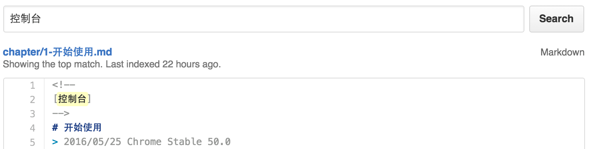

# Google Chrome Developer Tools Guide
> Chrome 开发者工具不完全指南

# 内容简介

`Chrome DevTools` 是非常强大的前端调试工具，是现阶段前端最好的战友。

当遇到开发时的问题，阅读文档并不是最好的选择。

阅读文档会花费额外的时间，且不能快速准确地提供解决方案。

而通过搜索引擎获得的结果，往往比较零碎。

本项目的初衷只是归纳与收集 `Chrome DevTools` 的使用技巧，成为一本`不完全指南`，在需要的时候，能在此查找出解决方案。

# 如何使用

##### 在`Github`顶部使用搜索功能搜索本仓库的内容

##### 注意

* 每篇文章的撰写**日期**与对应Chrome的**版本**都写在头部
* 关键字搜索**不支持**模糊匹配

# 参与项目

欢迎包括但不限于以下行为:

* 补充关键字
* 纠正错误
* 共同编辑
* ...

参与方法和步骤如下:

* 登录 <https://github.com>
* Fork `git@github.com:lixinliang/google-chrome-developer-tools-guide.git`
* 创建您的特性分支 (git checkout -b new-feature)
* 提交您的改动 (git commit -m 'Added some features or fixed a bug or change a text')
* 将您的改动记录提交到远程 git 仓库 (git push origin new-feature)
* 然后到 github 网站的该 git 远程仓库的 new-feature 分支下发起 Pull Request

# 参考链接

1. [官方开发者工具调试文档](https://developer.chrome.com/devtools)
2. [Chrome 开发者工具中文手册[未完全翻译]](https://github.com/CN-Chrome-DevTools/CN-Chrome-DevTools)
