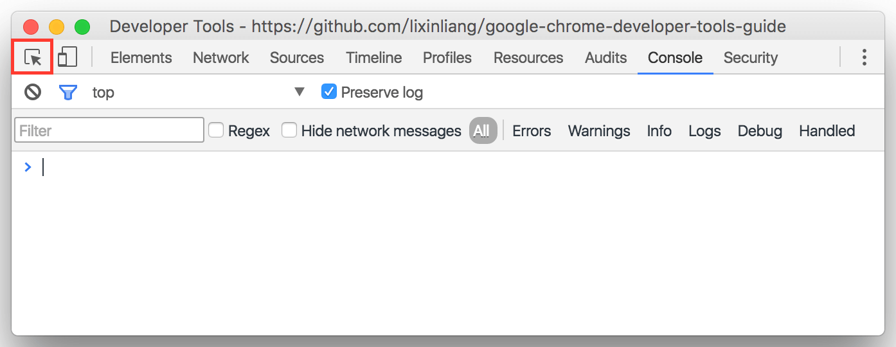
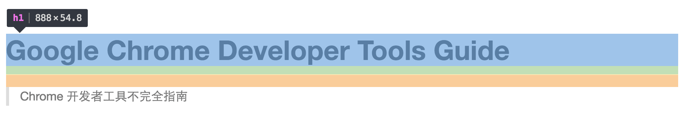
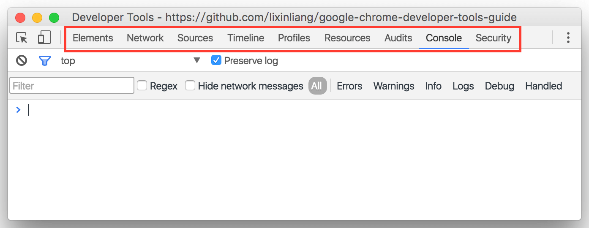
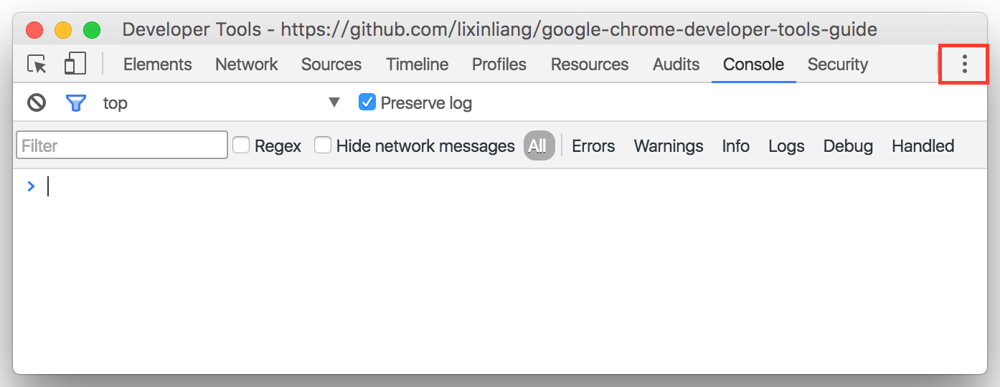
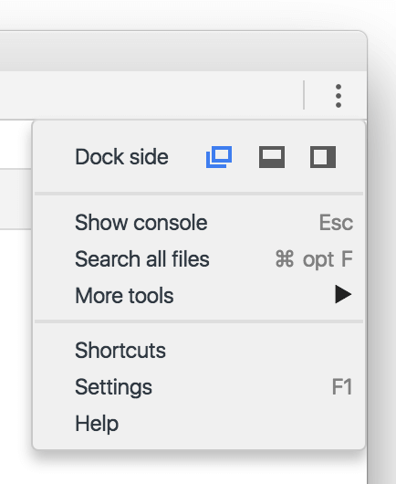

<!--
-->
# 菜单栏
> 2016/06/07 Chrome Stable 50.0

<!--
[]
-->
## 审查元素

直接选择页面上的元素并且在`Elements`面板上显示

使用的时候会显示该元素的标签种类以及盒子模型的长宽

蓝色代表content-box部分, 绿色是padding部分, 红色是margin部分

<!--
[模拟器]
-->
## 响应式设计

<!--
[]
-->
## 面板列表

<!--
[]
-->
## 更多

