<!--
-->
# 菜单栏
> 2016/06/07 Chrome Stable 50.0

<!--
-->
## 审查元素

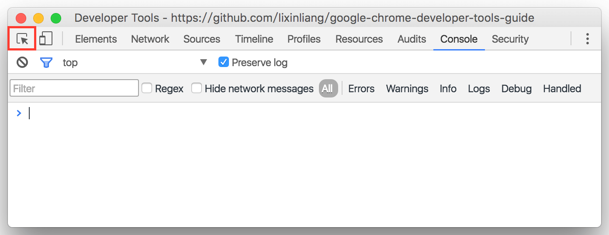

直接选择页面上的元素并且在`Elements`面板上显示

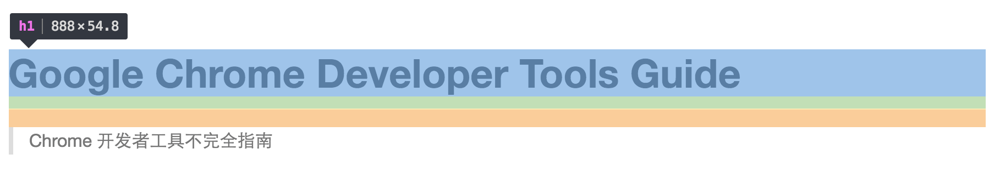

使用的时候会显示该元素的标签种类以及盒子模型的长宽

* 蓝色：content-box
* 绿色：padding
* 红色：margin

<!--
[模拟器,旋转,响应式,DPR,网络环境,截图]
-->
## 响应式设计

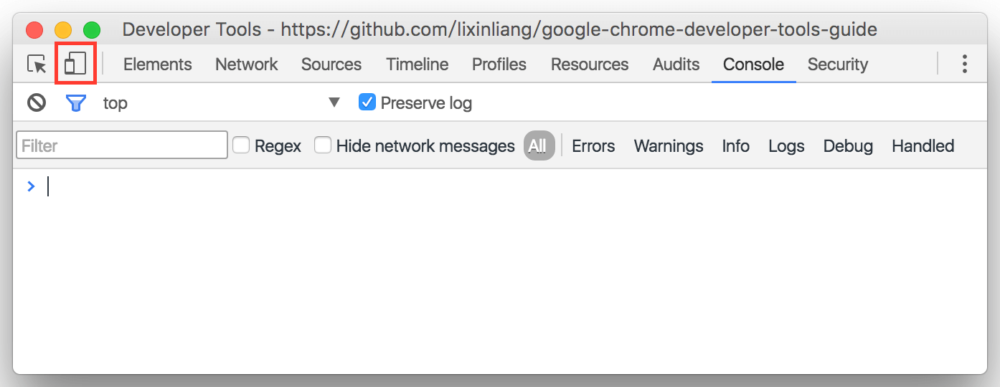

点击图标进入响应式设计

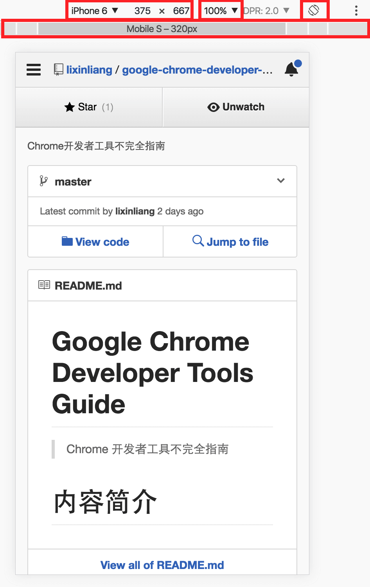

* 显示模拟的设备与尺寸，可切换设备。

* 可选择与设置显示的比例，默认100%。

* 可模拟设备旋转。

* 点击顶部灰色块状区域可快速切换设备，鼠标悬浮显示设备宽度。

### 响应式设计：选择设备

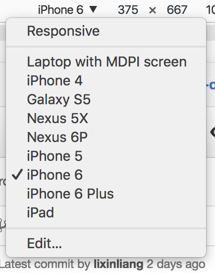

* 响应式模式下可以填写尺寸。

* 可添加、编辑设备。

### 响应式设计：更多

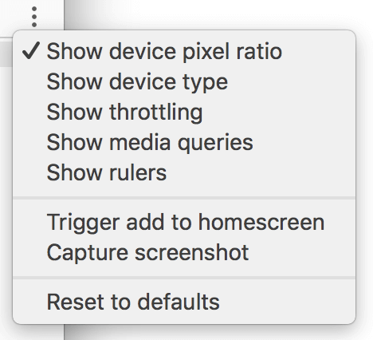

* 可显示设备DPR。

* 可显示设备类型。

* 可显示与模拟网络环境。

* 可显示`media query`规则的样式。

* 可显示辅助规尺。

* 截图。

### 响应式设计：显示`media query`规则

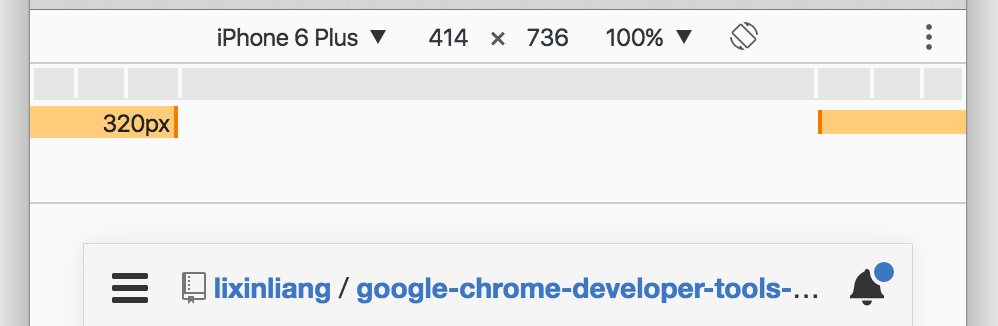

* 悬浮显示该断点适配宽度。

* 点击可快速切换到该宽度。

* 右键可查看该规则源码并在`sources`面板显示。

<!--
-->
## 面板列表

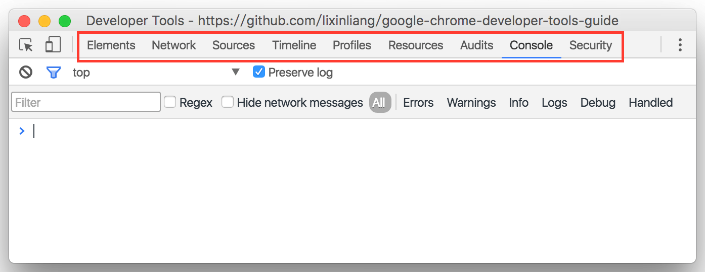

<!--
-->
## 更多

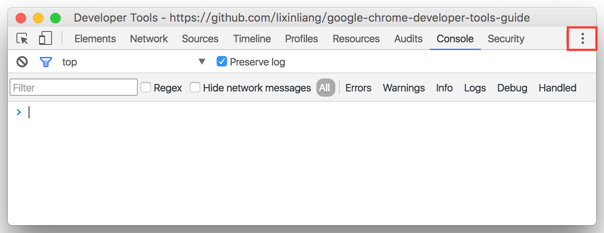

点击图标展开更多菜单。

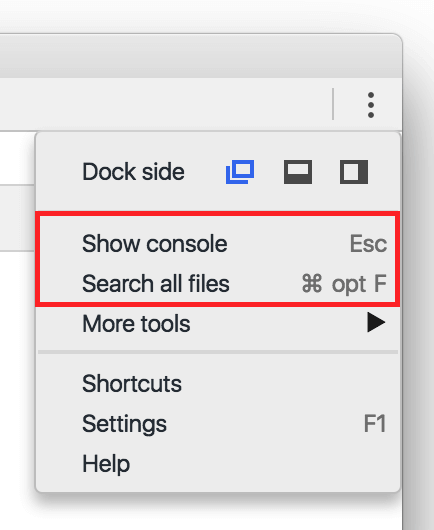

* 显示控制台。

* 跳转到副面板的`Search`面板。

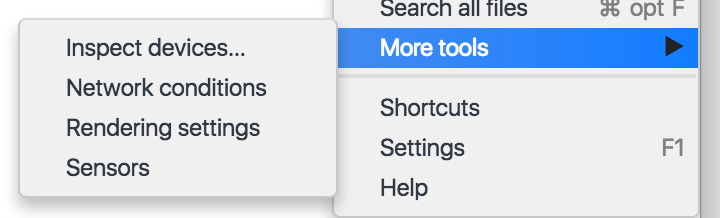

* 跳转到副面板的对应面板。