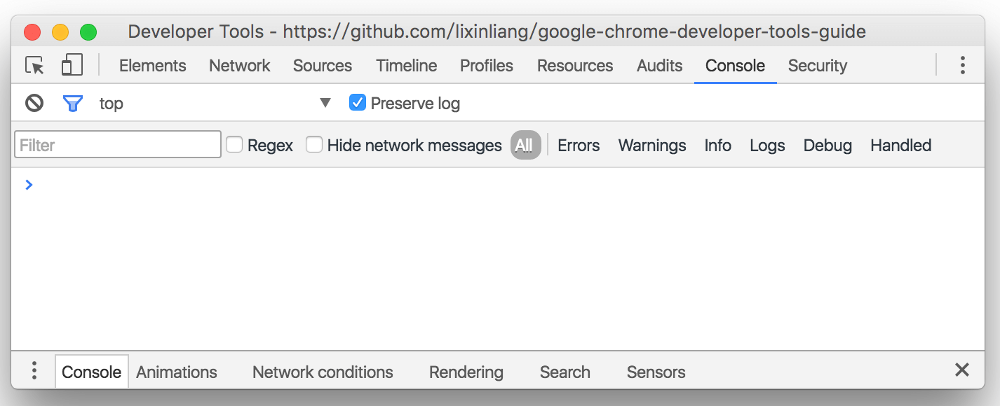
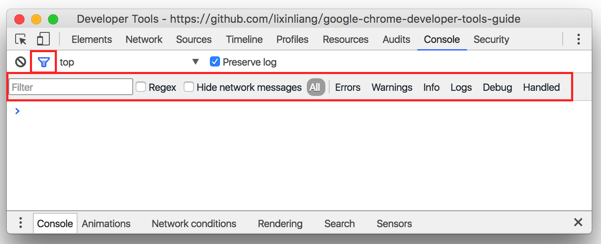
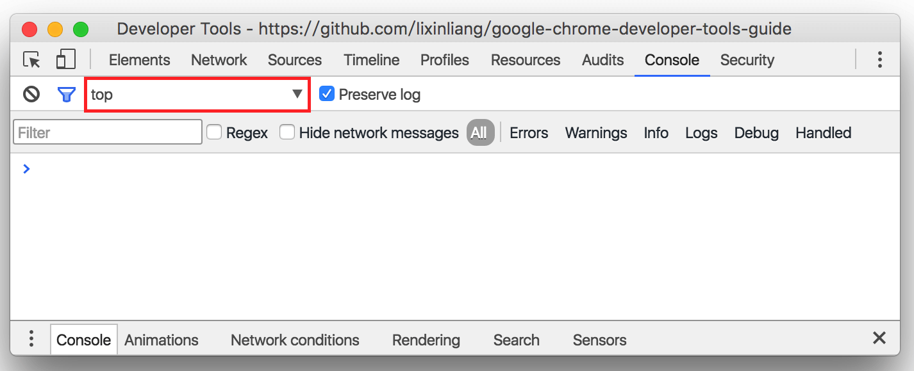
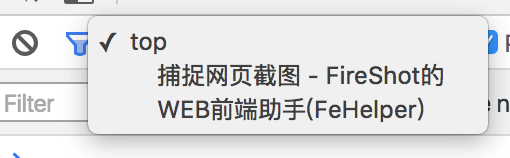
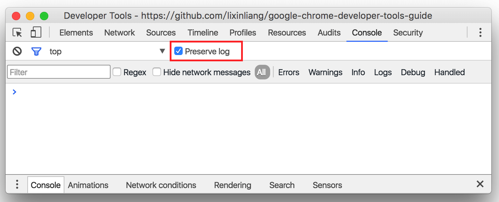
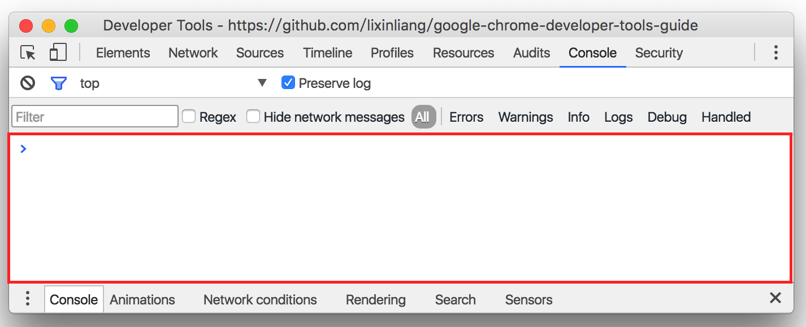
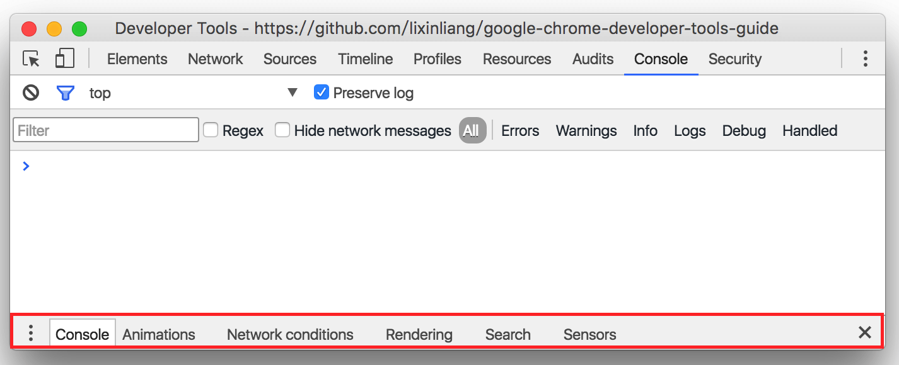

<!--
[console]
-->
# 控制台
> 2016/06/08 Chrome Stable 50.0

<!--
-->
## 清空控制台

<!--
-->
## 日志过滤器

<!--
[iframe]
-->
## 页面

<!--
-->
## 保留日志

当页面刷新或者跳转的时候，不清空日志

<!--
-->
## 控制台窗口

<!--
-->
## 功能菜单

