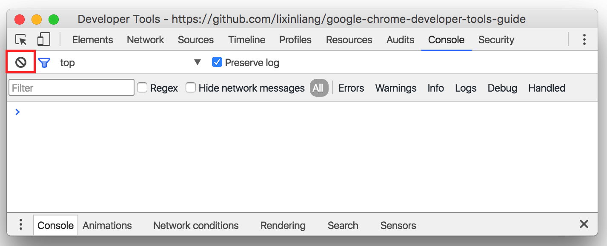
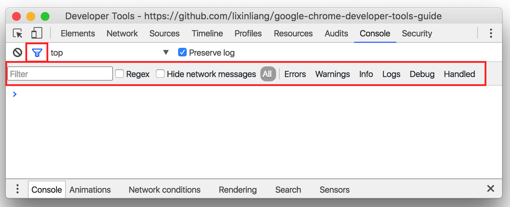
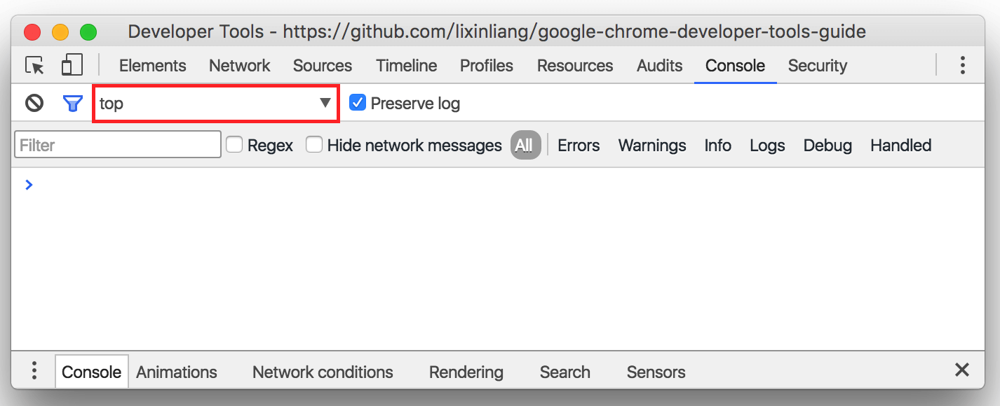
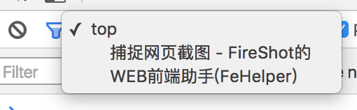
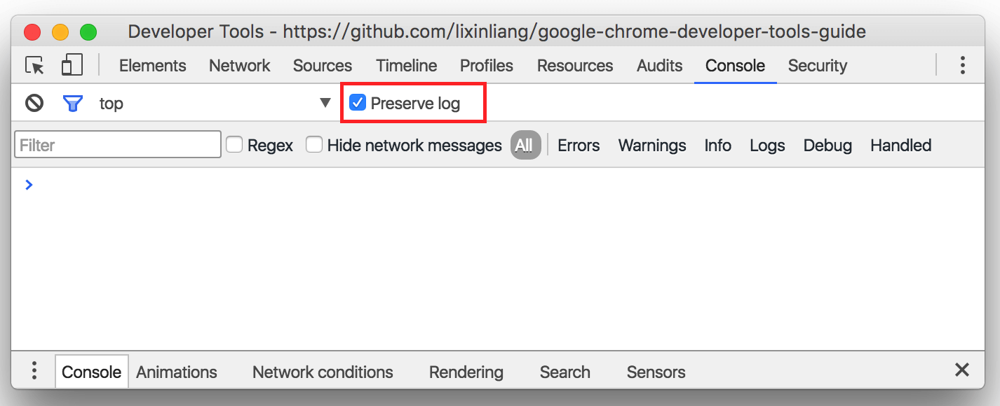
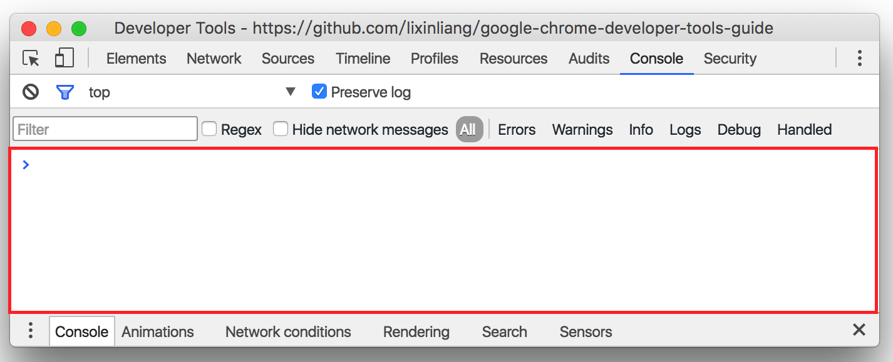
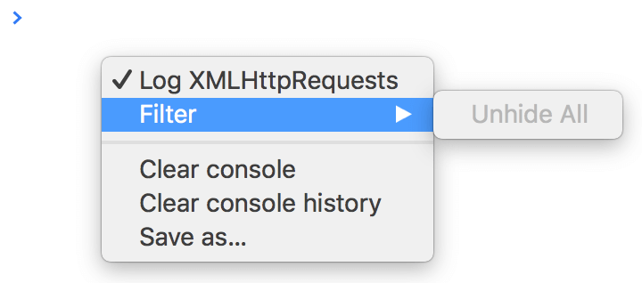
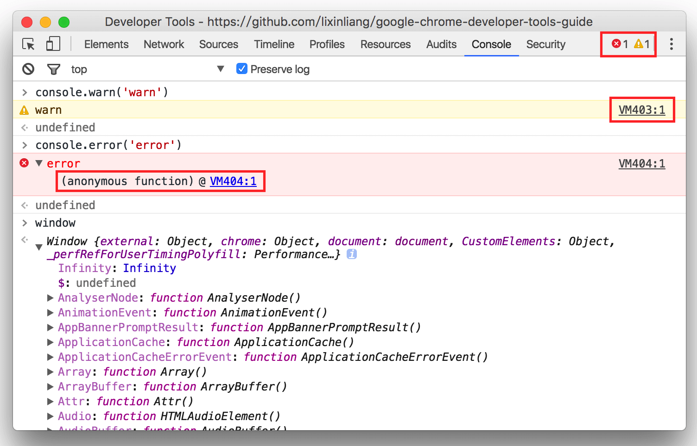
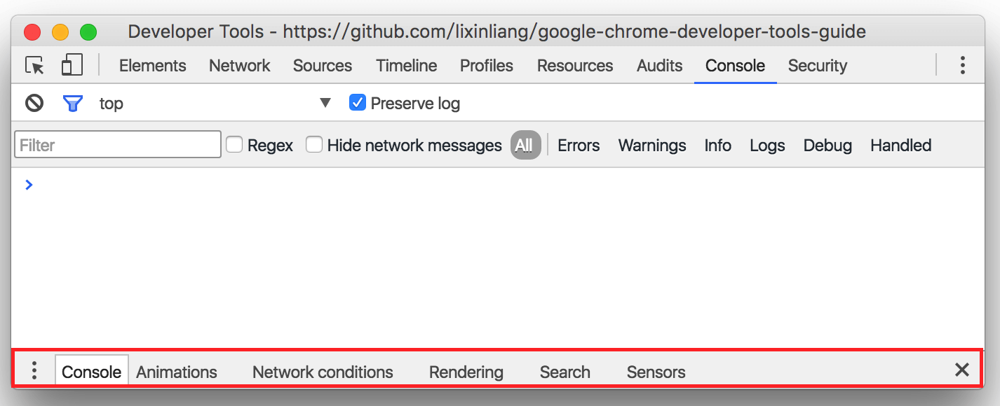

<!--
[console]
-->
# 控制台
> 2016/06/08 Chrome Stable 50.0

<!--
-->
## 清空日志

<!--
-->
## 日志过滤器

<!--
[iframe]
-->
## 选择页面

<!--
-->
## 保留日志

当页面刷新或者跳转的时候，不清空日志

<!--
-->
## 控制台窗口

* 右上角显示警告数量以及错误数量
* 每一条log都有对应的源码定位
* 对象可通过三角形按钮展开查看属性或者方法
* 错误对象可查看堆栈信息
* 展开的对象上的属性与方法是实时的

<!--
-->
## 功能菜单

