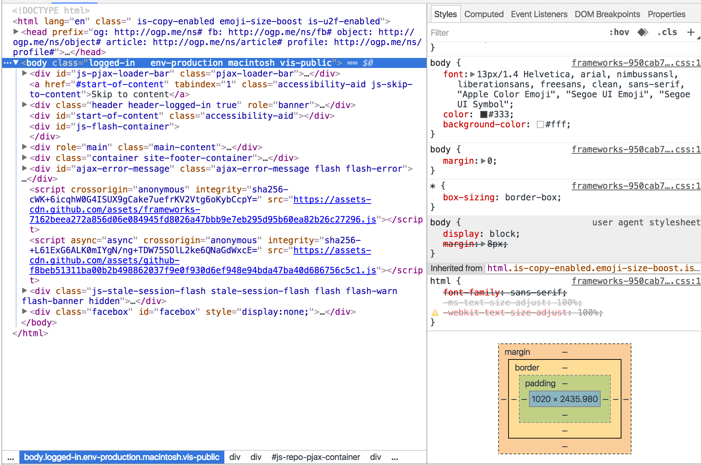
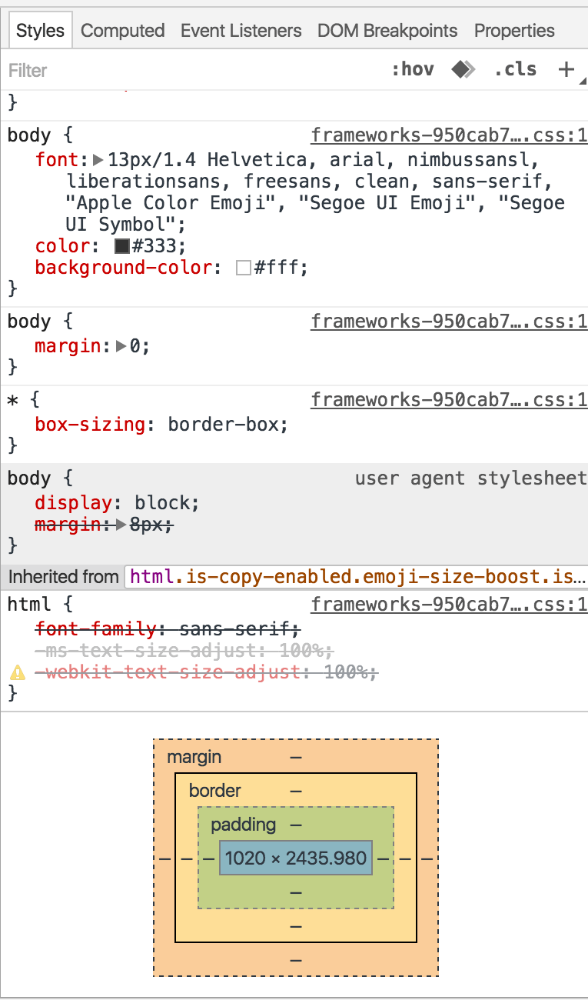
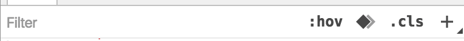
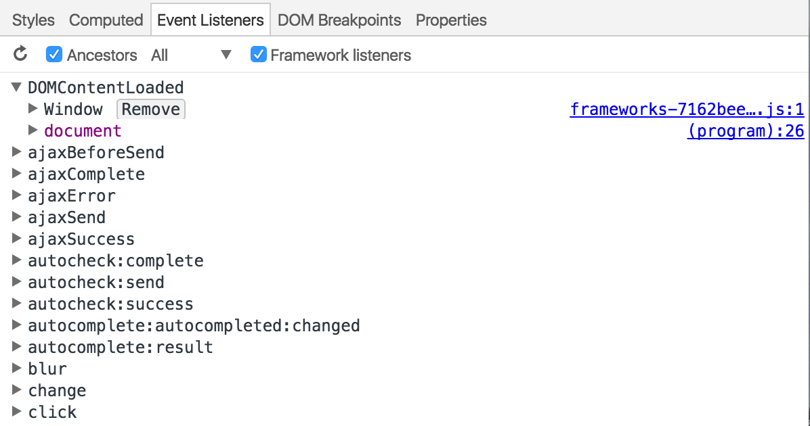
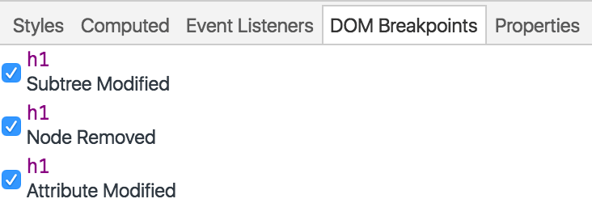
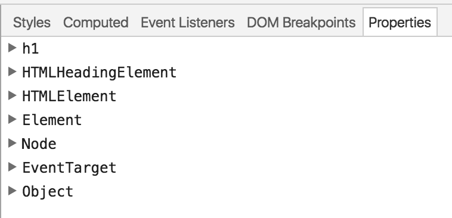

<!--
[elements]
-->
# 元素
> 2016/06/19 Chrome Stable 50.0

<!--
-->
## 页面文档

<!--
[hover,active]
-->
## 样式列表

#### 头部功能菜单

* 根据关键字过滤属性
* 为元素设置伪类
* 打开动画面板
* 增加/移除class
* 添加新的样式规则

<!--
-->
## 计算后的样式

* 显示计算后的盒子模型
* 计算后的样式列表

<!--
-->
## 事件监听列表

* 显示已注册的各个事件以及注册的源码位置
* 并且可以手动移除

<!--
-->
## DOM断点

* 该元素的DOM断点

<!--
-->
## 原型链

* 该元素的原型链
